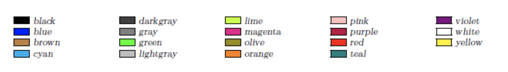

# powerpoint-DSL

## Motivation

### Target User
People who don't want to waste their time adjusting details in PowerPoint/ debugging Latex code.   
### Effect
Make some neat presentation slides without dealing with annoying details (parameters, debudding)
## Features
1. Plain text input 
2. Plain/ Bold/ Italic
3. Font Color
4. Font size
5. Table of contents based on sections (navigation on click)
6. Mathematical formulas (elementary operations)  // stretch goal

## Mac Install
1. Install [Homebrew](https://docs.brew.sh/Installation).
2. Install [LaTex](https://tug.org/mactex/morepackages.html).
   By typing the following command in your Terminal
   
   <code>brew cask install basictex</code>
   
   Note: `BasicTex`(80 MB) is highly recommended than `MacTex`(4 GB+) as it required less space.
   

## Windows Install
1. Install [LaTex](https://www.latex-project.org/get/). 
2. TBD

## Usage
### Grammar
PROGRAM::= TITLE (AUTHOR)? (SECTION)* \
TITLE::="Title: " CONTENT \
AUTHOR::= "Author: " CONTENT \
SECTION: "Section: " TITLE (PAGE)* \
PAGE::= "NewPage: " TITLE PAGESTUFF* \
PAGESTUFF::= POINT | PARAGRAPH | IMAGE \
POINT::= "BulletPoint: " CONTENT \
PARAGRAPH ::= “Paragraph”: CONTENT \
IMAGE ::= “Image:” IMAGEREF \
IMAGEREF::= URL\
URL::= "Url:" STRING  //STRETCH GOAL \
PATH::= "Path: " STRING \
CONTENT::= ( “@(” (SIZE | BI | COLOR)+  “)” )?  SENTENCE       //EXAMPLE : @(Size:bold Color:RED) Hello World \
SENTENCE::= STRING \
 \
SIZE::= "Size: " "“small” or “normal” or "big" or "large" or "huge” \
BI:: = "Bi: " "bold" or "italic” \
COLOR:: = "Color: ""red" or "green" ... \

FORMULA::= "Formula: " STRING  //STRETCH GOAL

### Note
1. When we say "STRING" here, we mean any string without whitespaces and that is not a keyword.
2. Available colors: 19 basic colors of xcolor package.

3. Available font sizes: small, normal, big, large, huge
4. Available font styles: bold, italic
5. Animations are not supported
6. Automatic image size fit is not supported. 
7. More than 4 images in a single page is not allowed.
8. Title of section cannot be bold and italic at the same time. 

## Contributors
Feiyi Wang, Marta Yao, Pengwei Zhou, Jialu Zhang, Jialin Liu
## Acknowledgements
Open-source LaTex template (https://www.overleaf.com/latex/templates/a-modern-beamer-theme-mtheme/qzyvdhrntfmr#.Vjsvnt-qpBd) created by Matthias Vogelgesang

